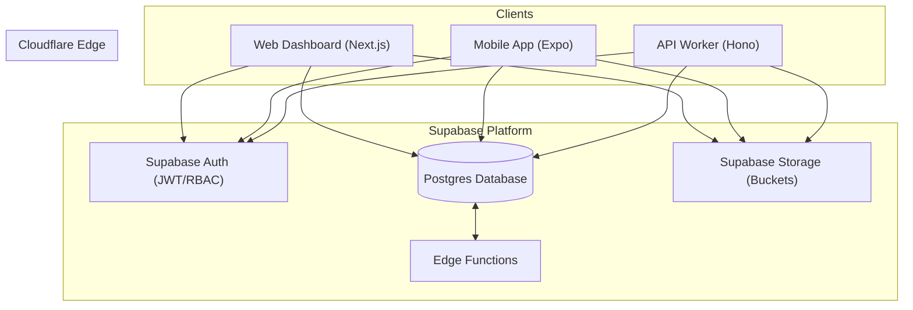

# Architecture Cloudflare — KBouffe

> **Version** : 1.1  
> **Date** : Mars 2026  
> **Stack** : Cloudflare Workers + Supabase (Postgres, Auth, Storage)

---

## 🏗️ Vue d'ensemble



---

## 📊 Base de données (Supabase)

### Schéma Unifié

**Rôle** : Centralisation des données restaurants, utilisateurs et commandes.

| Table | Description |
|-------|-------------|
| `restaurants` | Catalogue public (nom, logo, position GPS, cuisine, note) |
| `users` | Utilisateurs plateforme (clients + marchands) avec `role` |
| `menus` | Catégories et plats par restaurant |
| `orders` | Commandes clients reliées aux restaurants |
| `stock` | État des stocks par restaurant |

---

## 🔄 Flux de données (Supabase Integration)

### Authentification & Accès (RBAC)
L'accès aux données est contrôlé par les **Row Level Security (RLS)** de Supabase, garantissant que les marchands ne voient que leurs propres restaurants et commandes.

### Synchronisation Realtime
Les tableaux de bord utilisent le client Supabase pour s'abonner aux changements sur les tables `orders`, permettant une mise à jour instantanée sans polling.

---

## 📁 Structure du projet

```
kbouffe.com/
├── apps/
│   ├── web-dashboard/          # Next.js (Cloudflare Workers)
│   │   └── src/
│   │       ├── app/
│   │       │   ├── admin/      # Dashboard plateforme (Super Admin)
│   │       │   ├── dashboard/  # Interface marchande (Merchant)
│   │       │   └── explore/    # Vitrine client
│   │       └── lib/
│   │           └── supabase/   # Client Supabase (browser/server)
│   │
│   ├── mobile-client/          # Expo React Native
│   │
│   └── api/                    # API Worker (Hono)
│       ├── src/
│       │   ├── routes/         # Endpoints REST
│       │   └── modules/        # Business logic par domaine
│       ├── wrangler.toml
│       └── package.json
│
├── packages/
│   ├── shared-types/           # Types TypeScript partagés
│   └── module-core/            # Components & context providers partagés
│
└── docs/
    └── ARCHITECTURE.md         # Ce document
```

---

## 🛠️ Technologies

| Composant | Technologie | Rôle |
|-----------|-------------|------|
| **Client DB** | Supabase JS | SDK unifié pour Auth/DB/Storage |
| **Bases de données** | Supabase Postgres | Base relationnelle avec RLS |
| **Storage** | Supabase Storage | Images de plats, logos, KYC |
| **Compute** | Cloudflare Workers | API (Hono), SSR (Next.js) |
| **Auth** | Supabase Auth | Gestion des identités et tokens JWT |
| **Frontend** | Next.js 16 + React 19 | Dashboard marchand + Vitrine web |
| **Mobile** | Expo + React Native | App client mobile |

---

## 🚀 Roadmap d'implémentation (Supabase Transition)

### Phase 1 : Migration Backend (Terminé)
- [x] Configuration du client Supabase dans `api` et `web-dashboard`
- [x] Migration des schémas D1 vers Supabase
- [x] Implémentation des RLS policies initiales

### Phase 2 : Dashboard Admin (En cours)
- [x] Interface de gestion des restaurants
- [x] Fix des endpoints de fetch admin
- [x] Support des rôles RBAC (Super Admin)

### Phase 3 : Nettoyage & Optimisation
- [x] Suppression des dépendances Drizzle
- [ ] Suppression des fichiers D1/Wrangler inutiles
- [ ] Optimisation des performances des requêtes Supabase

---

## 💰 Coûts estimés (Supabase Free Tier)

| Ressource | Limite gratuite | Usage estimé |
|-----------|-----------------|--------------|
| Database | 500MB | < 100MB |
| Bandwidth | 5GB | < 1GB |
| Auth Users | 50,000 MAU | < 1,000 MAU |
| Storage | 1GB | < 200MB |

**Verdict** : Supabase Free Tier est parfaitement adapté pour le lancement du MVP.
